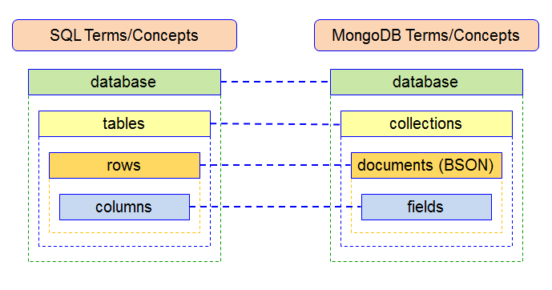
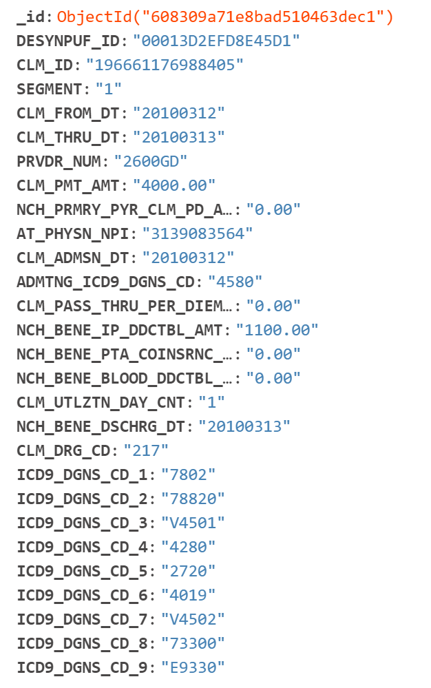

# Welcome to MongoDB!!

[MongoDB](https://www.mongodb.com/) is a document database, storing data in JSON-like documents. MongoDB Documentation can be found [here](https://docs.mongodb.com/). 

One way to look at MongoDB is to compare it to SQL. In MongoDB, data is stored in BSON format, which is a binary version of JSON. Instead of tables, data is stored in collections. 

 

Thanks for the visual [freeCodeCamp!](https://www.freecodecamp.org/news/learn-mongodb-a4ce205e7739/)

## MongoDB for Healthcare!

[MongoDB for Healthcare](https://www.mongodb.com/industries/healthcare) has information about how healthcare comapnies can build a competitive advantage with MongoDB. Noteably, MongoDB is interoperable, allowing users to share data, save lives, and conquer costs! 

## MongoDB Languages
MongoDB provides official support for a large number of programming languages and frameworks includings:
 * C
 * C++
 * C#
 * Java
 * Node.js
 * Perl
 * PHP
 * Python
 * Ruby
 * Mongoid
 
Keep this in mind when you deploy MongoDB and select the language you are most familiar with or would like to use! 

## Deploying MongoDB
The [MongoDB Website](https://www.mongodb.com/try/download) has a section to look at the deployment options, including Cloud and On-premises options. 

I utilize the MongoDB Community Server, which when Downloaded provides the option for you to download MongoDB Compass. MongoDB Compass community allows you to connect to your clusters from your PC with a GUI. 

## Connecting to Cluster
View this [tutorial](https://bjm009.github.io/HealthAnalyticsToolkit/MongoDB/mongo_cluster) to see how to create and connect to a cluster from the MongoDB Compass GUI. 

## Create Database
In MongoDB Compass, you create a database and add its first collection at the same time. To do this:
* Click Create Database to open the dialog
* Enter the name of the database and its first collection
* Click Create Database

## Inserting Documents into Database
In MongoDB Compass, you can click "Import Data". Here you can Browse your PC and Select the file you would like to import. The file type can be either a JSON or CSV. 

I utilized this data from this [link](https://www.cms.gov/Research-Statistics-Data-and-Systems/Downloadable-Public-Use-Files/SynPUFs/DESample01), downloaded as "DE1.0 Sample 1 2008-2010 Inpatient Claims (ZIP)". 

When importing, the data, it is a CSV document. Once inserted, each of the rows will become a document formatted as a JSON file. A single document from this file looks like the following: 

## MongoDB has a unique set of vocabulary compared to other common languages. Check out the information below to learn more about it! 
  * [MongoDB Vocabulary](https://bjm009.github.io/HealthAnalyticsToolkit/MongoDB/mongo_vocab)
