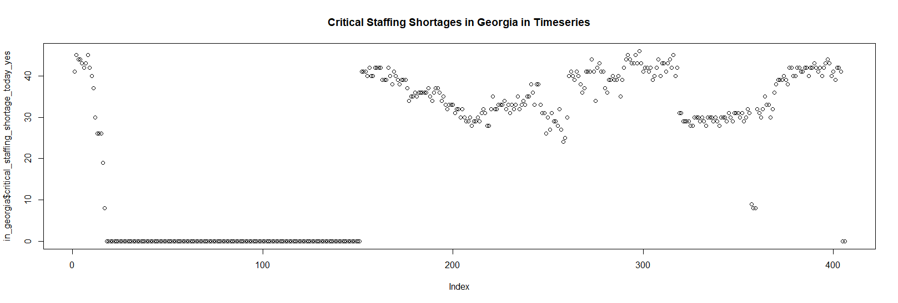
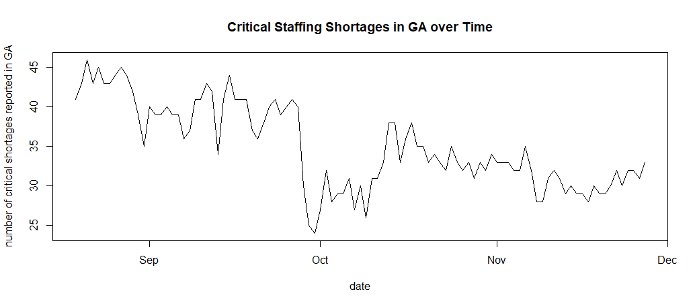
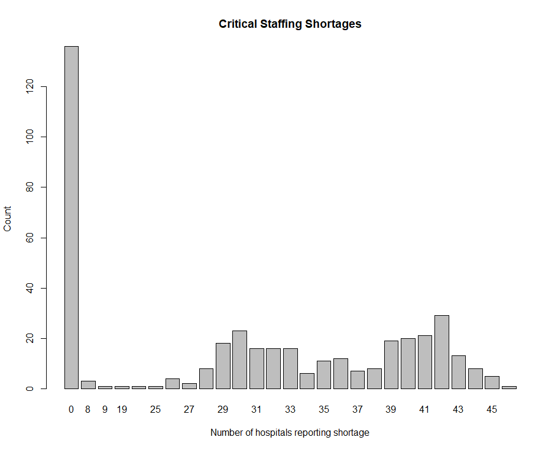

# Visualizations with R

There are a number of graphical visualizations you can create with R. Let us explore some of them! 

We are going to be using the same dataset from this [tutorial](https://github.gatech.edu/pages/bmclain3/Health_Analytics/R/r_analysis_example), starting with "mydata" available to us. 

## Watch this video to see the basics in action!
<iframe width="560" height="315" src="https://www.youtube.com/embed/vgBzwNseziA" title="YouTube video player" frameborder="0" allow="accelerometer; autoplay; clipboard-write; encrypted-media; gyroscope; picture-in-picture" allowfullscreen></iframe>

## "The Default Scatterplot Function"

```r
in_georgia <- mydata[mydata$state == "GA",]
```

Using a logical operator, we store all the rows for the state of Georgia in the `in_georgia` variable. 

```r
plot(in_georgia$critical_staffing_shortage_today_yes,main="Critical Staffing Shortages in Georgia in Timeseries")
```




## Line Plot

We can also use a line plot to look at the trends of this data! 

To do this, we first make a list of the critical staffing shortages reported in Georgia to use as the y-value for our graph. To do this, we take the `critical_staffing_shortage_today_yes` from the `in_georgia` variable be previously made. 
```r
y <- in_georgia$critical_staffing_shortage_today_yes
```

Then, we locate the dates and use `as.Date()` to convert between character representations and objects of class "Date" representing calendar dates. 
```r
x <- as.Date(in_georgia$date)
```

Finally, we plot the data, specifically looking at the trend of critical staffing shortages reported during the fall (data points 200 to 300). 
```r
plot(x[200:300], y[200:300], type = 'l', xlab = "date", 
    ylab = "number of critical shortages reported in GA", 
    main = "Critical Staffing Shortages in GA over Time")
``` 



## Barplot

```r
count<-table(in_georgia$critical_staffing_shortage_today_yes)
```
    0   8   9  19  24  25  26  27  28  29  30  31  32 
    136   3   1   1   1   1   4   2   8  18  23  16  16 
    33  34  35  36  37  38  39  40  41  42  43  44  45 
    16   6  11  12   7   8  19  20  21  29  13   8   5 
    46 
    1


To get count, we use table. According to R documentation, *"table uses the cross-classifying factors to build a contingency table of the counts at each combination of factor levels."* Essentially meaning, it counts the instances of each number in the list given to it. 

```r
barplot(count, main = "Critical Staffing Shortages", xlab = "Number of hospitals reporting shortage", ylab= "Count")
```


