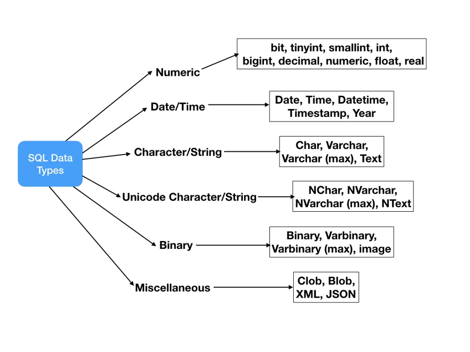

## Here are some of the basics you should know!

### Watch this video to see the basics in action!

<iframe width="560" height="315" src="https://www.youtube.com/embed/cSnq4Ei59os" title="YouTube video player" frameborder="0" allow="accelerometer; autoplay; clipboard-write; encrypted-media; gyroscope; picture-in-picture" allowfullscreen></iframe>

### Creating a table

```sql
CREATE TABLE cohort_1 (id INTEGER PRIMARY KEY, patient TEXT, age INTEGER );
```

The above code is how to create a table. *Importantly*, we need a unique identifier for each row in a database. This may be needed later to identify rows without relying on the surrounding rows as they could be deleted. The `id` input into the database holds the unique identifier. For this, the data type is set to `INTEGER PRIMARY KEY`, which tells the database to treat it as row identifier and that each row must have a unique value for this column. 

In the creation of the table, each of the variables is followed by a datatype. 

Examples of datatypes that can be used are shown here:



> Source: [SQL Data Types](https://www.journaldev.com/16774/sql-data-types)

### Inserting Data

```sql
INSERT INTO cohort_1 VALUES (1, "Peter", 35);
INSERT INTO cohort_1 VALUES (2, "Mary", 21); 
INSERT INTO cohort_1 VALUES (3, "Sheldon", 10);
INSERT INTO cohort_1 VALUES (4, "Luke", 37);
INSERT INTO cohort_1 VALUES (5, "Drew", 2);
INSERT INTO cohort_1 VALUES (6, "Gertrude", 88);
INSERT INTO cohort_1 VALUES (7, "Mac", 25);
INSERT INTO cohort_1 VALUES (8, "Beatrice", 45);
INSERT INTO cohort_1 VALUES (9, "Phil", 61); 
```

The result is a table that looks like the following: 

| id | patient  | age |
|----|----------|-----|
| 1  | Peter    | 35  |
| 2  | Mary     | 21  |
| 3  | Sheldon  | 10  |
| 4  | Luke     | 37  |
| 5  | Drew     | 2   |
| 6  | Gertrude | 88  |
| 7  | Mac      | 25  |
| 8  | Beatrice | 45  |
| 9  | Phil     | 61  |

### Retrieving data

To form a query, you need to use `SELECT`. 

```sql
SELECT age FROM cohort_1;
```

We will then see all the patient ages in the cohort. 

| age |
|-----|
| 35  |
| 21  |
| 10  |
| 37  |
| 2   |
| 88  |
| 25  |
| 45  |
| 61  |

```sql
SELECT * FROM cohort_1;
```

This will give us the resulting table with all the columns. 

| id | patient  | age |
|----|----------|-----|
| 1  | Peter    | 35  |
| 2  | Mary     | 21  |
| 3  | Sheldon  | 10  |
| 4  | Luke     | 37  |
| 5  | Drew     | 2   |
| 6  | Gertrude | 88  |
| 7  | Mac      | 25  |
| 8  | Beatrice | 45  |
| 9  | Phil     | 61  |

If we want to know specifically the patients sorted by age, youngest to oldest we can add `ORDER BY` to the previous query. `ORDER BY` will order by the column specified, smallest to largest. 

```sql
SELECT * FROM cohort_1 ORDER BY age;
```

| id | patient  | age |
|----|----------|-----|
| 5  | Drew     | 2   |
| 3  | Sheldon  | 10  |
| 2  | Mary     | 21  |
| 7  | Mac      | 25  |
| 1  | Peter    | 35  |
| 4  | Luke     | 37  |
| 8  | Beatrice | 45  |
| 9  | Phil     | 61  |
| 6  | Gertrude | 88  |

If you want the order to be reversed and to be oldest to youngest, you can add `DESC`. 

```sql
SELECT * FROM cohort_1 ORDER BY age DESC;
```

| id | patient  | age |
|----|----------|-----|
| 6  | Gertrude | 88  |
| 9  | Phil     | 61  |
| 8  | Beatrice | 45  |
| 4  | Luke     | 37  |
| 1  | Peter    | 35  |
| 7  | Mac      | 25  |
| 2  | Mary     | 21  |
| 3  | Sheldon  | 10  |
| 5  | Drew     | 2   |

If you want to know which patients are adults, or patients older than 17 we can use a `WHERE` clause. 

```sql
SELECT * FROM cohort_1 WHERE age > 17 ORDER BY age;
```

| id | patient  | age |
|----|----------|-----|
| 2  | Mary     | 21  |
| 7  | Mac      | 25  |
| 1  | Peter    | 35  |
| 4  | Luke     | 37  |
| 8  | Beatrice | 45  |
| 9  | Phil     | 61  |
| 6  | Gertrude | 88  |

You can use a number of different comparison operators here depending on what you want to look for. 

### Altering table after creation - adding columns

To add another column to the table, we use `ALTER` and define the column we want to add as condition. 

```sql
ALTER TABLE cohort_1 ADD condition TEXT;
```

Now, when we add in the next patient, we can include that column if we would like. 

```sql
INSERT INTO cohort_1 (patient, age, condition) VALUES ("Billy", 55, "heart disease");
```

If we look at the table using:

```sql
SELECT * FROM cohort_1;
```

We will see that the table creates with an extra column for condition.

| id | patient  | age | condition   | 
|----|----------|-----|-------------|
| 1  | Peter    | 35  |             |
| 2  | Mary     | 21  |             |
| 3  | Sheldon  | 10  |             |
| 4  | Luke     | 37  |             |
| 5  | Drew     | 2   |             |
| 6  | Gertrude | 88  |             |
| 7  | Mac      | 25  |             |
| 8  | Beatrice | 45  |             |
| 9  | Phil     | 61  |             |
| 10 | Billy    | 55  |heart disease|


### Updating data in the table

Say on a routine physical, Sheldon, age 10 is diagnosed with idiopathic scoliosis. We can update the table to reflect that. 

```sql
UPDATE cohort_1 SET condition = "idiopathic scoliosis" WHERE patient = "Sheldon";
```

| id | patient  | age | condition           | 
|----|----------|-----|---------------------|
| 1  | Peter    | 35  |                     |
| 2  | Mary     | 21  |                     |
| 3  | Sheldon  | 10  |idiopathic scoliosis |
| 4  | Luke     | 37  |                     |
| 5  | Drew     | 2   |                     |
| 6  | Gertrude | 88  |                     |
| 7  | Mac      | 25  |                     |
| 8  | Beatrice | 45  |                     |
| 9  | Phil     | 61  |                     |
| 10 | Billy    | 55  |heart disease        |


### Now that you know the basics, go on to explore SQL Examples!
