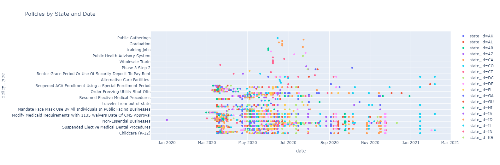
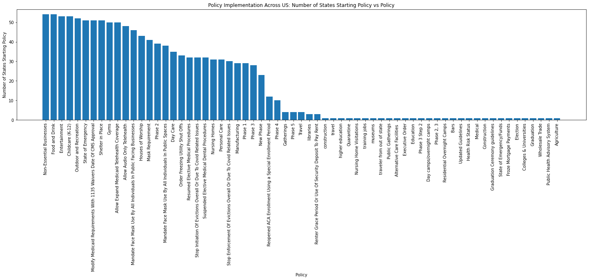

# COVID-19 Analysis 

First, the correct libraries need to be imported. This tutorial utilizes the following libraries: 

   - [pandas](https://pandas.pydata.org/) is a data analysis and manipulation tool 
   - [NumPy](https://numpy.org/doc/stable/contents.html) is a package for the scientific computing in Python that provides a multidimensional array object, arrays, matrices, and an assortment of opperations and manipulations. 
   - [matplotlib.pyplot](https://matplotlib.org/stable/api/_as_gen/matplotlib.pyplot.html) provides a MATLAB-like way of plotting

```python
import pandas as pd
import numpy as np
import matplotlib.pyplot as plt
``` 

# **Import the Data** 

The file used in this tutorial can be found [here](https://healthdata.gov/dataset/COVID-19-State-and-County-Policy-Orders/gyqz-9u7n). The information is regularly updated so if you get slighly different numerical results, do not be concerned. Data is stored in a csv file. To read the data, we can use *pandas.read_csv*. This reads a comma-separated values (csv) file into a DataFrame.

```python
data = pd.read_csv("state_policy_updates_20210221_0722.csv") #Read csv
data
```

<div>

<table border="1" class="dataframe">
  <thead>
    <tr style="text-align: right;">
      <th></th>
      <th>state_id</th>
      <th>county</th>
      <th>fips_code</th>
      <th>policy_level</th>
      <th>date</th>
      <th>policy_type</th>
      <th>start_stop</th>
      <th>comments</th>
      <th>source</th>
      <th>total_phases</th>
    </tr>
  </thead>
  <tbody>
    <tr>
      <th>0</th>
      <td>HI</td>
      <td>NaN</td>
      <td>NaN</td>
      <td>state</td>
      <td>2020-05-18</td>
      <td>Manufacturing</td>
      <td>start</td>
      <td>Policy_Details: Open with adjusted "Safe Pract...</td>
      <td>sip_submission_form: https://governor.hawaii.g...</td>
      <td>NaN</td>
    </tr>
    <tr>
      <th>1</th>
      <td>TX</td>
      <td>Kinney</td>
      <td>48271.0</td>
      <td>county</td>
      <td>2020-07-03</td>
      <td>Mask Requirement</td>
      <td>start</td>
      <td>Policy_Details: County is approved to be exemp...</td>
      <td>sip_submission_form: https://tdem.texas.gov/ga...</td>
      <td>NaN</td>
    </tr>
    <tr>
      <th>2</th>
      <td>ID</td>
      <td>Custer</td>
      <td>16037.0</td>
      <td>county</td>
      <td>2020-10-27</td>
      <td>Phase 3</td>
      <td>start</td>
      <td>Policy_Details: No greater than 50 people at i...</td>
      <td>sip_submission_form: https://coronavirus.idaho...</td>
      <td>4.0</td>
    </tr>
    <tr>
      <th>3</th>
      <td>UT</td>
      <td>Wayne</td>
      <td>49055.0</td>
      <td>county</td>
      <td>2020-11-24</td>
      <td>Phase 1</td>
      <td>start</td>
      <td>Policy_Details: Restrictions for highest level...</td>
      <td>sip_submission_form: https://coronavirus.utah....</td>
      <td>3.0</td>
    </tr>
    <tr>
      <th>4</th>
      <td>IL</td>
      <td>Ford</td>
      <td>17053.0</td>
      <td>county</td>
      <td>2021-01-15</td>
      <td>Food and Drink</td>
      <td>start</td>
      <td>Policy_Details: Bars and restaurants: Open wit...</td>
      <td>sip_submission_form: https://coronavirus.illin...</td>
      <td>5.0</td>
    </tr>
    <tr>
      <th>...</th>
      <td>...</td>
      <td>...</td>
      <td>...</td>
      <td>...</td>
      <td>...</td>
      <td>...</td>
      <td>...</td>
      <td>...</td>
      <td>...</td>
      <td>...</td>
    </tr>
    <tr>
      <th>4175</th>
      <td>TX</td>
      <td>Morris</td>
      <td>48343.0</td>
      <td>county</td>
      <td>2020-07-03</td>
      <td>Mask Requirement</td>
      <td>start</td>
      <td>Policy_Details: County is approved to be exemp...</td>
      <td>sip_submission_form: https://tdem.texas.gov/ga...</td>
      <td>NaN</td>
    </tr>
    <tr>
      <th>4176</th>
      <td>ME</td>
      <td>Piscataquis</td>
      <td>23021.0</td>
      <td>county</td>
      <td>2020-05-18</td>
      <td>Outdoor and Recreation</td>
      <td>start</td>
      <td>Policy_Details: Rural Reopening :  wilderness ...</td>
      <td>sip_submission_form: https://www.maine.gov/cov...</td>
      <td>3.0</td>
    </tr>
    <tr>
      <th>4177</th>
      <td>NY</td>
      <td>NaN</td>
      <td>NaN</td>
      <td>state</td>
      <td>0020-06-08</td>
      <td>Resumed Elective Medical Procedures</td>
      <td>start</td>
      <td>Other measures and details for this policy inc...</td>
      <td>BU COVID-19 State Policy Database</td>
      <td>NaN</td>
    </tr>
    <tr>
      <th>4178</th>
      <td>WV</td>
      <td>NaN</td>
      <td>NaN</td>
      <td>state</td>
      <td>2020-03-19</td>
      <td>Food and Drink</td>
      <td>start</td>
      <td>Other measures and details for this policy inc...</td>
      <td>BU COVID-19 State Policy Database</td>
      <td>NaN</td>
    </tr>
    <tr>
      <th>4179</th>
      <td>IL</td>
      <td>Lee</td>
      <td>17103.0</td>
      <td>county</td>
      <td>2021-01-15</td>
      <td>Non-Essential Businesses</td>
      <td>start</td>
      <td>Policy_Details: - All employees return to work...</td>
      <td>sip_submission_form: https://coronavirus.illin...</td>
      <td>5.0</td>
    </tr>
  </tbody>
</table>
<p>4180 rows × 10 columns</p>
</div>


# **Clean the Data**

After reading the data in, we want to clean the data. In this dataset, some of the dates state 0020 instead of 2020 for the year. Additionally, one data point has 1899 as the date. Being that COVID is more recent, that year is assumed to be 2020 as well. The following code locates and fixes the errors in the dates in the data set. 


```python
dates_to_change = []
for index, row in data.iterrows():
  if "0020" == row.date[0:4]:
    data.loc[index, "date"] = "2020" + row.date[4:]
  elif "1899" == row.date[0:4]:
    data.loc[index, "date"] = "2020" + row.date[4:]
```

Th above **for loop** iterates through each row in the DataFrame stored in data. With each row, the if/elsif statements check to see if the first four digits of the date are either "0020" or "1899" with the **equal-to operator (==)**. If either of the error values are present, the values are replaced with "2020". 

# **Analysis**

## **Initial Investigation of Policies**

To begin the investigation, let us visualize the data in a scatter plot. The below code does just that in the following steps:

1. Sort the values by the "state_id" column. 
2. Using a mask, find and store all the rows that are labeled as "start" in the "start_stop" column in a variable called "start_scat"
3. Create a scatter plot with the data in "start_scat". Put the values from the "date" column on the x-axis and "policy_type" on the y-axis. The color of the dot on the scatter plot will be assigned by the "state_id", meaning that each of the dots associated with a given state will be the same color. . 

```python
sorted = data.sort_values(by=["state_id"]) #sort the data by state
start_scat = sorted[(sorted.start_stop=="start")]
px.scatter(start_scat, x="date",y= "policy_type", color = "state_id", title = "Policies by State and Date")
```



The initial scatterplot provides a crude visualization of how start of policies in timeseries, color-coded by state. There is not much one can tell from this graph aside from the fact that the implementation of any given policy varied widely in time. 

## **Investigating the Number of Times Each Policy Starts**

The code below finds the three most started policies, by counting the number of times that policy was started. This means if that policy was started mulitple times in a single state, it would be counted each time. 


```python
start_data = data[(data.start_stop=="start")] #Look only at the start of policies
policies = start_data.policy_type.unique() #Find all the unique policies
count = [] #Create an empty count vector

for val in start_data.policy_type.unique(): #Create a for loop to go through each unique policy 
  ope = start_data[start_data.policy_type == val] #using a mask, find all the policies that match the unique policy
  siz = ope.shape #find out the number of rows that have that policy
  count.append(siz[0])
  
d = {"policy":policies, "num_starts":count}
results = pd.DataFrame(d) #create results dataframe
results.sort_values(by=["num_starts"], ascending = False) #sort the data from largest to smallest number of starts
```


<div>
<style scoped>
    .dataframe tbody tr th:only-of-type {
        vertical-align: middle;
    }

    .dataframe tbody tr th {
        vertical-align: top;
    }

    .dataframe thead th {
        text-align: right;
    }
</style>
<table border="1" class="dataframe">
  <thead>
    <tr style="text-align: right;">
      <th></th>
      <th>policy</th>
      <th>num_starts</th>
    </tr>
  </thead>
  <tbody>
    <tr>
      <th>10</th>
      <td>Shelter in Place</td>
      <td>462</td>
    </tr>
    <tr>
      <th>4</th>
      <td>Food and Drink</td>
      <td>263</td>
    </tr>
    <tr>
      <th>16</th>
      <td>Outdoor and Recreation</td>
      <td>242</td>
    </tr>
    <tr>
      <th>1</th>
      <td>Mask Requirement</td>
      <td>239</td>
    </tr>
    <tr>
      <th>13</th>
      <td>Non-Essential Businesses</td>
      <td>226</td>
    </tr>
    <tr>
      <th>...</th>
      <td>...</td>
      <td>...</td>
    </tr>
    <tr>
      <th>44</th>
      <td>Medical</td>
      <td>1</td>
    </tr>
    <tr>
      <th>38</th>
      <td>Colleges &amp; Universities</td>
      <td>1</td>
    </tr>
    <tr>
      <th>42</th>
      <td>Graduation Ceremony guidelines</td>
      <td>1</td>
    </tr>
    <tr>
      <th>41</th>
      <td>State of Emergency/Funds</td>
      <td>1</td>
    </tr>
    <tr>
      <th>64</th>
      <td>Agriculture</td>
      <td>1</td>
    </tr>
  </tbody>
</table>
<p>65 rows × 2 columns</p>
</div>


By printing the dataframe, one can see the policies with the most starts include: Shelter in Place with 462 starts, Food and Drink with 263 starts, and Outdoor and Recreation with 242 starts. 

## **Investigating the Widespread Use of Policies**

The code below looks the number of states/territories that implemented each policy. This is interesting to see how widespread the implementation of certain policies are and to determine their reach across the nation.

```python
count = [] #reset count to 0
for val in start_data.policy_type.unique(): #loop through each unique policy
  poli = start_data[start_data.policy_type == val] # poli hold the dataframe rows for the unique policy 
  ct = 0 #set a counter variable to 0
  for val2 in poli.state_id.unique(): #loop through each unique state within poli
    ct = ct + 1 #increment count for each unique state
  count.append(ct) #Add the number of states to the counter list

results["num_states"] = count #Add to the results dataframe
results.sort_values(by=["num_states"], ascending = False) #sort the data by state
```


<div>
<style scoped>
    .dataframe tbody tr th:only-of-type {
        vertical-align: middle;
    }

    .dataframe tbody tr th {
        vertical-align: top;
    }

    .dataframe thead th {
        text-align: right;
    }
</style>
<table border="1" class="dataframe">
  <thead>
    <tr style="text-align: right;">
      <th></th>
      <th>policy</th>
      <th>num_starts</th>
      <th>num_states</th>
    </tr>
  </thead>
  <tbody>
    <tr>
      <th>13</th>
      <td>Non-Essential Businesses</td>
      <td>226</td>
      <td>54</td>
    </tr>
    <tr>
      <th>4</th>
      <td>Food and Drink</td>
      <td>263</td>
      <td>54</td>
    </tr>
    <tr>
      <th>12</th>
      <td>Entertainment</td>
      <td>196</td>
      <td>53</td>
    </tr>
    <tr>
      <th>5</th>
      <td>Childcare (K-12)</td>
      <td>193</td>
      <td>53</td>
    </tr>
    <tr>
      <th>16</th>
      <td>Outdoor and Recreation</td>
      <td>242</td>
      <td>52</td>
    </tr>
    <tr>
      <th>...</th>
      <td>...</td>
      <td>...</td>
      <td>...</td>
    </tr>
    <tr>
      <th>38</th>
      <td>Colleges &amp; Universities</td>
      <td>1</td>
      <td>1</td>
    </tr>
    <tr>
      <th>36</th>
      <td>Graduation</td>
      <td>1</td>
      <td>1</td>
    </tr>
    <tr>
      <th>11</th>
      <td>Wholesale Trade</td>
      <td>5</td>
      <td>1</td>
    </tr>
    <tr>
      <th>27</th>
      <td>Public Health Advisory System</td>
      <td>27</td>
      <td>1</td>
    </tr>
    <tr>
      <th>64</th>
      <td>Agriculture</td>
      <td>1</td>
      <td>1</td>
    </tr>
  </tbody>
</table>
<p>65 rows × 3 columns</p>
</div>


The policies with the most widespread implementation include: Non-Essential Businesses with 54 states/territories starting that policy, Food and Drink with 54 states/territories starting that policy, Entertainment with 53 states/territories starting that policy, and Childcare (K-12) with 53 states/terrirtories starting that policy. 

## **Visualization of Policy Implementation Across the US**

```python
sorted_by_state = results.sort_values(by=["num_states"], ascending = False) #sort the data by state
plt.figure(figsize=(25, 5))
plt.bar(sorted_by_state.policy,sorted_by_state.num_states)
plt.xticks(rotation = 'vertical')
plt.ylabel('Number of States Starting Policy')
plt.xlabel('Policy')
plt.title("Policy Implementation Across US: Number of States Starting Policy vs Policy")
```




# **What about Mask Requirements?**

In as early as April, the [CDC recommended masks](https://www.npr.org/sections/coronavirus-live-updates/2020/04/03/826219824/president-trump-says-cdc-now-recommends-americans-wear-cloth-masks-in-public) to prevent the spread of the virus. However, interestingly, masks requirements do not make the top of the list for the number or starts or for being a widespread policy across the nation. This seems to be a major gap in slowing/stopping the pandemic! 

To further understand, we want to look at which policies involve masks and further investigate them. 

```python
num = 0; 
for index, row in results.iterrows():
  if ("Mask" in row.policy):
    num = num+1  
```
The above for loop iterates thorugh each row in the DataFrame. If the work "mask" appeared within the policy name of a given row, the counting variable "num" was increased by 1. 

After completion of this loop, num equals 3. There are three different mask related policies: "Mask Requirements", "Mandate Face Mask Use By All Individuals In Public Spaces", and "Mandate Face Mask Use By All Individuals In Public Facing Businesses", all of which we will look at below. 

```python
mask_req = results[results.policy == "Mask Requirement"]
mask_public = results[results.policy =="Mandate Face Mask Use By All Individuals In Public Spaces"]
mask_bus = results[results.policy =="Mandate Face Mask Use By All Individuals In Public Facing Businesses"] 
```

```python
mask_req
```

<div>
<style scoped>
    .dataframe tbody tr th:only-of-type {
        vertical-align: middle;
    }

    .dataframe tbody tr th {
        vertical-align: top;
    }

    .dataframe thead th {
        text-align: right;
    }
</style>
<table border="1" class="dataframe">
  <thead>
    <tr style="text-align: right;">
      <th></th>
      <th>policy</th>
      <th>num_starts</th>
      <th>num_states</th>
    </tr>
  </thead>
  <tbody>
    <tr>
      <th>1</th>
      <td>Mask Requirement</td>
      <td>239</td>
      <td>41</td>
    </tr>
  </tbody>
</table>
</div>


```python
mask_public
```


<div>
<style scoped>
    .dataframe tbody tr th:only-of-type {
        vertical-align: middle;
    }

    .dataframe tbody tr th {
        vertical-align: top;
    }

    .dataframe thead th {
        text-align: right;
    }
</style>
<table border="1" class="dataframe">
  <thead>
    <tr style="text-align: right;">
      <th></th>
      <th>policy</th>
      <th>num_starts</th>
      <th>num_states</th>
    </tr>
  </thead>
  <tbody>
    <tr>
      <th>14</th>
      <td>Mandate Face Mask Use By All Individuals In Pu...</td>
      <td>38</td>
      <td>38</td>
    </tr>
  </tbody>
</table>
</div>


```
mask_bus
```


<div>
<style scoped>
    .dataframe tbody tr th:only-of-type {
        vertical-align: middle;
    }

    .dataframe tbody tr th {
        vertical-align: top;
    }

    .dataframe thead th {
        text-align: right;
    }
</style>
<table border="1" class="dataframe">
  <thead>
    <tr style="text-align: right;">
      <th></th>
      <th>policy</th>
      <th>num_starts</th>
      <th>num_states</th>
    </tr>
  </thead>
  <tbody>
    <tr>
      <th>24</th>
      <td>Mandate Face Mask Use By All Individuals In Pu...</td>
      <td>46</td>
      <td>46</td>
    </tr>
  </tbody>
</table>
</div>


Mask Requirement had the highest number of starts with 239 starts and 41 different states. Mandate Face Mask Use By all Individuals in Public Facing Businesses had the next highest number, with 46 starts and 46 states. Finally, Mandate Face Mask Use By All Individuals in Public Spaces had 38 starts and 38 states. 

With these numbers, the next question is: How many states implemented any of the Masks policies? The following code investigates that question. 


```python
data_copy = data.copy() #Create a copy of the data

#Loop through and change any policy type involving masks to be called Mask in the copy of the data
for index, row in data_copy.iterrows():
 if ("Mask" in row.policy_type):
       data_copy.loc[index, "policy_type"] = "Mask"

data_copy = data_copy[(data_copy.start_stop=="start")] #Look only at the data that is a "start"

count = [] #reset count to 0
for val in data_copy.policy_type.unique(): #loop through each unique policy
  poli = data_copy[data_copy.policy_type == val] # poli hold the dataframe rows for the unique policy 
  ct = 0 #set a counter variable to 0
  for val2 in poli.state_id.unique(): #loop through each unique state within poli
    ct = ct + 1 #increment count for each unique state
  count.append(ct) #Add the number of states to the counter list

policies2 = data_copy.policy_type.unique() #Find all the unique policies

w = {"policy":policies2, "num_states":count}
results_mask = pd.DataFrame(w) #create dataframe

results_mask[(results_mask.policy == "Mask")] #Look at the number of states that implemented a mask related policy
```


<div>
<style scoped>
    .dataframe tbody tr th:only-of-type {
        vertical-align: middle;
    }

    .dataframe tbody tr th {
        vertical-align: top;
    }

    .dataframe thead th {
        text-align: right;
    }
</style>
<table border="1" class="dataframe">
  <thead>
    <tr style="text-align: right;">
      <th></th>
      <th>policy</th>
      <th>num_states</th>
    </tr>
  </thead>
  <tbody>
    <tr>
      <th>1</th>
      <td>Mask</td>
      <td>51</td>
    </tr>
  </tbody>
</table>
</div>


In total, 51 states/territoties implemented a mask related policy. This is more widespread than the individual policies, however, would still not be in one of the top five policies implemented accross the country. Furthermore, there is variance in what these three different mask policies mean for the public regarding face coverings. 


```python
mask_reqs_start_scat = px.scatter(data_copy[(data_copy.policy_type == "Mask")], x="date",y= "policy_type", color = "state_id", title = "Start Mask Requirement")

mask_reqs_start_scat
```


The states that did implement mask related policies started them at a variety of points throughout the pandemic. For example, HI started a mask related policy on Dec 30, 2020, this is well into the pandemic. AK and MN being two of the first to have the policy started, beginning them back in March when the pandemic was starting! 

Hopefully this example gave you some ideas of how you can visualize and analyze datasets using Python!! 

