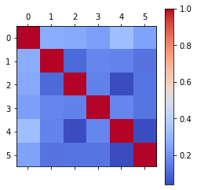
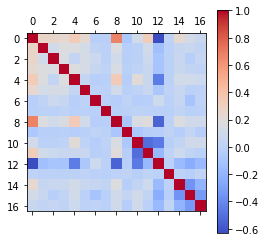
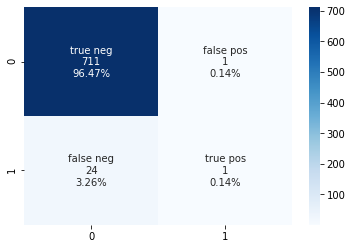
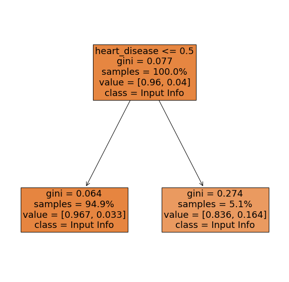
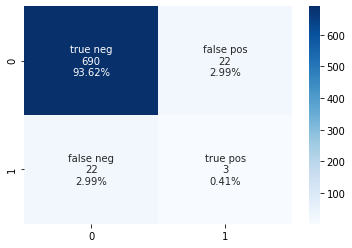

# Predictive Analytics

## About the Data:
The data used in this example was obtained from Kaggle at the following link: https://www.kaggle.com/fedesoriano/stroke-prediction-dataset. This contained information for specific features in the data as well as a column that indicates if the person did or did not have a stroke. Stroke is the 2nd leading cause of death in the world and is responsible for approximately 11% of all deaths worldwide. We are going to use the dataset to determine if a random forest classification model can effectively predict stroke from the inputs provided. 

### What data do we have? 
1. id: unique identifier
2. gender: "Male", "Female", or "Other
3. age: age of the patient
4. hypertension: 0 if the patient doesn't have hypertention, 1 if the patient has hypertension
5. heart_disease: 0 if the patient doesn't have any heart diseases, 1 if the patient has a heart disease
6. ever_married: "No" or "Yes"
7. work_type: "children", "Govt_job", "Never_worked", "Private", or "Self-employed"
8. Residence_type: "Rural" or "Urban"
9. avg_glucose_level: average glucose level in blood
10. bmi: body mass index
11. smoking_status: "formerly smoked", "never_smoked", "smokes", or "Unknown"
12. stroke: 1 if patient had a stroke or 0 if not

Id, age, avg_glucose_level, and bmi are numerical features. The others are categorical. The attribute/feature "stroke" is the one of interest that the model will be trained to predict based on the other features. The id feature will not be informative to the model, as it just contains the patient identifier, no valuable health information. Therefore, we will remove that column and investigate the other features in the data. 

# Let's Code!! 

### Import

```python
import pandas as pd
import numpy as np
import sklearn
from sklearn import tree, ensemble, preprocessing, metrics
from sklearn.model_selection import train_test_split
from sklearn.model_selection import GridSearchCV
from sklearn.tree import plot_tree
import matplotlib.pyplot as plt
import seaborn as sns
```
* [pandas](https://pandas.pydata.org/pandas-docs/stable/index.html) is a library that provides high-performance, easy-to-use data structures and data analysis tools. Importantly, by importing pandas we are able to utilize dataframes. [Check out this page to learn more about dataframes!](https://github.gatech.edu/pages/bmclain3/Health_Analytics/python/dataframes).
* [numpy](https://numpy.org/) is considered to be a fundamental package for scientific computing with python, bringing the computational power of languages like C and Fortran. Among other things, NumPy offers powerful n-dimensional arrays, numerical computing tools, and allows for interoperability. 
* [sklearn](https://scikit-learn.org/stable/) is for Machine Learning in Python
    * [sklearn.tree](https://scikit-learn.org/stable/modules/classes.html#module-sklearn.tree) includes decision tree-based models for classificaiton and regression
    * [sklearn.ensemble](https://scikit-learn.org/stable/modules/ensemble.html) allows for combining the predictions of several base estimators built with a given learning algorithm to improve the estimator. 
    * [sklearn.preprocessing](https://scikit-learn.org/stable/modules/preprocessing.html) provides several common utility functions and transformer classes to change raw feature vectors into a more suitable representation for the estimators. 
    * [sklearn.metrics](https://scikit-learn.org/stable/modules/classes.html#module-sklearn.metrics) includes score functions, performance metrics, and pairwise metrics and distance computations. 
    * [sklearn.model_selection.train_test_split](https://scikit-learn.org/stable/modules/generated/sklearn.model_selection.train_test_split.html) splits arrays or matrices into random train and test subsets
    * [sklearn.model_selection.GridSearchCV](https://scikit-learn.org/stable/modules/generated/sklearn.model_selection.GridSearchCV.html#sklearn-model-selection-gridsearchcv) provides an exhaustive search over specified parameter values for an estimator. 
    * [sklearn.tree.plot_tree](https://scikit-learn.org/stable/modules/generated/sklearn.tree.plot_tree.html) plots a decision tree
* [matplotlib](https://matplotlib.org/) is a library for creating static, animated, and interactive visualizations in Python. pyplot is the state-based interface to matplotlib, which is intended for interactive plots and simple plot generation. 
* [seaborn](https://seaborn.pydata.org/) Python data visualization library based on matplotlib to draw statistical graphs. 

### Import Data

```python
data = pd.read_excel("stroke_data.xlsx") #Read file
```

<div>
<style scoped>
    .dataframe tbody tr th:only-of-type {
        vertical-align: middle;
    }

    .dataframe tbody tr th {
        vertical-align: top;
    }

    .dataframe thead th {
        text-align: right;
    }
</style>
<table border="1" class="dataframe">
  <thead>
    <tr style="text-align: right;">
      <th></th>
      <th>id</th>
      <th>gender</th>
      <th>age</th>
      <th>hypertension</th>
      <th>heart_disease</th>
      <th>ever_married</th>
      <th>work_type</th>
      <th>Residence_type</th>
      <th>avg_glucose_level</th>
      <th>bmi</th>
      <th>smoking_status</th>
      <th>stroke</th>
    </tr>
  </thead>
  <tbody>
    <tr>
      <th>0</th>
      <td>9046</td>
      <td>Male</td>
      <td>67.0</td>
      <td>0</td>
      <td>1</td>
      <td>Yes</td>
      <td>Private</td>
      <td>Urban</td>
      <td>228.69</td>
      <td>36.6</td>
      <td>formerly smoked</td>
      <td>1</td>
    </tr>
    <tr>
      <th>1</th>
      <td>51676</td>
      <td>Female</td>
      <td>61.0</td>
      <td>0</td>
      <td>0</td>
      <td>Yes</td>
      <td>Self-employed</td>
      <td>Rural</td>
      <td>202.21</td>
      <td>NaN</td>
      <td>never smoked</td>
      <td>1</td>
    </tr>
    <tr>
      <th>2</th>
      <td>31112</td>
      <td>Male</td>
      <td>80.0</td>
      <td>0</td>
      <td>1</td>
      <td>Yes</td>
      <td>Private</td>
      <td>Rural</td>
      <td>105.92</td>
      <td>32.5</td>
      <td>never smoked</td>
      <td>1</td>
    </tr>
    <tr>
      <th>3</th>
      <td>60182</td>
      <td>Female</td>
      <td>49.0</td>
      <td>0</td>
      <td>0</td>
      <td>Yes</td>
      <td>Private</td>
      <td>Urban</td>
      <td>171.23</td>
      <td>34.4</td>
      <td>smokes</td>
      <td>1</td>
    </tr>
    <tr>
      <th>4</th>
      <td>1665</td>
      <td>Female</td>
      <td>79.0</td>
      <td>1</td>
      <td>0</td>
      <td>Yes</td>
      <td>Self-employed</td>
      <td>Rural</td>
      <td>174.12</td>
      <td>24.0</td>
      <td>never smoked</td>
      <td>1</td>
    </tr>
    <tr>
      <th>...</th>
      <td>...</td>
      <td>...</td>
      <td>...</td>
      <td>...</td>
      <td>...</td>
      <td>...</td>
      <td>...</td>
      <td>...</td>
      <td>...</td>
      <td>...</td>
      <td>...</td>
      <td>...</td>
    </tr>
    <tr>
      <th>5105</th>
      <td>18234</td>
      <td>Female</td>
      <td>80.0</td>
      <td>1</td>
      <td>0</td>
      <td>Yes</td>
      <td>Private</td>
      <td>Urban</td>
      <td>83.75</td>
      <td>NaN</td>
      <td>never smoked</td>
      <td>0</td>
    </tr>
    <tr>
      <th>5106</th>
      <td>44873</td>
      <td>Female</td>
      <td>81.0</td>
      <td>0</td>
      <td>0</td>
      <td>Yes</td>
      <td>Self-employed</td>
      <td>Urban</td>
      <td>125.20</td>
      <td>40.0</td>
      <td>never smoked</td>
      <td>0</td>
    </tr>
    <tr>
      <th>5107</th>
      <td>19723</td>
      <td>Female</td>
      <td>35.0</td>
      <td>0</td>
      <td>0</td>
      <td>Yes</td>
      <td>Self-employed</td>
      <td>Rural</td>
      <td>82.99</td>
      <td>30.6</td>
      <td>never smoked</td>
      <td>0</td>
    </tr>
    <tr>
      <th>5108</th>
      <td>37544</td>
      <td>Male</td>
      <td>51.0</td>
      <td>0</td>
      <td>0</td>
      <td>Yes</td>
      <td>Private</td>
      <td>Rural</td>
      <td>166.29</td>
      <td>25.6</td>
      <td>formerly smoked</td>
      <td>0</td>
    </tr>
    <tr>
      <th>5109</th>
      <td>44679</td>
      <td>Female</td>
      <td>44.0</td>
      <td>0</td>
      <td>0</td>
      <td>Yes</td>
      <td>Govt_job</td>
      <td>Urban</td>
      <td>85.28</td>
      <td>26.2</td>
      <td>Unknown</td>
      <td>0</td>
    </tr>
  </tbody>
</table>
<p>5110 rows × 12 columns</p>
</div>


### Look at list of features
```python
print("Features:")
for i,col in enumerate(data.columns):
    print(i,"\t",col)
```

    Features:
    0 	 id
    1 	 gender
    2 	 age
    3 	 hypertension
    4 	 heart_disease
    5 	 ever_married
    6 	 work_type
    7 	 Residence_type
    8 	 avg_glucose_level
    9 	 bmi
    10 	 smoking_status
    11 	 stroke
    

### Removing a column from data
```python
data_no_id = data.drop(columns = ['id'])
```

### Investigating Correlations
To better understand the data, the correlation can be looked at. To do this, Pandas **dataframe.corr()** is used to find the pairwise correlation of all columns in the dataframe. Of note, this will only work for numerical data types. Non-numeric data type columns in the dataframe are ignored. This can be seen in the correlation map below. 

```python
corr_1 = data_no_id.corr()
plt.matshow(corr_1,cmap='coolwarm')
plt.colorbar()
plt.show()
print("Correlation with numerical variable:\n")
corr_1.stroke.sort_values()
```

 


    Correlation with numerical variable:
    
    


    bmi                  0.042374
    hypertension         0.127904
    avg_glucose_level    0.131945
    heart_disease        0.134914
    age                  0.245257
    stroke               1.000000
    Name: stroke, dtype: float64

Of the numerical columns, age has the largest correlation coefficient of ~0.25 which shows a substantial positive correlation. 


To look at the other, non-numerical features, **get_dummies** can be used. 


```python
data_dummies = pd.get_dummies(data_no_id, prefix_sep='_', drop_first=True) 
data_dummies.reset_index(drop=True)
data_dummies
```


<div>
<style scoped>
    .dataframe tbody tr th:only-of-type {
        vertical-align: middle;
    }

    .dataframe tbody tr th {
        vertical-align: top;
    }

    .dataframe thead th {
        text-align: right;
    }
</style>
<table border="1" class="dataframe">
  <thead>
    <tr style="text-align: right;">
      <th></th>
      <th>age</th>
      <th>hypertension</th>
      <th>heart_disease</th>
      <th>avg_glucose_level</th>
      <th>bmi</th>
      <th>stroke</th>
      <th>gender_Male</th>
      <th>gender_Other</th>
      <th>ever_married_Yes</th>
      <th>work_type_Never_worked</th>
      <th>work_type_Private</th>
      <th>work_type_Self-employed</th>
      <th>work_type_children</th>
      <th>Residence_type_Urban</th>
      <th>smoking_status_formerly smoked</th>
      <th>smoking_status_never smoked</th>
      <th>smoking_status_smokes</th>
    </tr>
  </thead>
  <tbody>
    <tr>
      <th>0</th>
      <td>67.0</td>
      <td>0</td>
      <td>1</td>
      <td>228.69</td>
      <td>36.6</td>
      <td>1</td>
      <td>1</td>
      <td>0</td>
      <td>1</td>
      <td>0</td>
      <td>1</td>
      <td>0</td>
      <td>0</td>
      <td>1</td>
      <td>1</td>
      <td>0</td>
      <td>0</td>
    </tr>
    <tr>
      <th>1</th>
      <td>61.0</td>
      <td>0</td>
      <td>0</td>
      <td>202.21</td>
      <td>NaN</td>
      <td>1</td>
      <td>0</td>
      <td>0</td>
      <td>1</td>
      <td>0</td>
      <td>0</td>
      <td>1</td>
      <td>0</td>
      <td>0</td>
      <td>0</td>
      <td>1</td>
      <td>0</td>
    </tr>
    <tr>
      <th>2</th>
      <td>80.0</td>
      <td>0</td>
      <td>1</td>
      <td>105.92</td>
      <td>32.5</td>
      <td>1</td>
      <td>1</td>
      <td>0</td>
      <td>1</td>
      <td>0</td>
      <td>1</td>
      <td>0</td>
      <td>0</td>
      <td>0</td>
      <td>0</td>
      <td>1</td>
      <td>0</td>
    </tr>
    <tr>
      <th>3</th>
      <td>49.0</td>
      <td>0</td>
      <td>0</td>
      <td>171.23</td>
      <td>34.4</td>
      <td>1</td>
      <td>0</td>
      <td>0</td>
      <td>1</td>
      <td>0</td>
      <td>1</td>
      <td>0</td>
      <td>0</td>
      <td>1</td>
      <td>0</td>
      <td>0</td>
      <td>1</td>
    </tr>
    <tr>
      <th>4</th>
      <td>79.0</td>
      <td>1</td>
      <td>0</td>
      <td>174.12</td>
      <td>24.0</td>
      <td>1</td>
      <td>0</td>
      <td>0</td>
      <td>1</td>
      <td>0</td>
      <td>0</td>
      <td>1</td>
      <td>0</td>
      <td>0</td>
      <td>0</td>
      <td>1</td>
      <td>0</td>
    </tr>
    <tr>
      <th>...</th>
      <td>...</td>
      <td>...</td>
      <td>...</td>
      <td>...</td>
      <td>...</td>
      <td>...</td>
      <td>...</td>
      <td>...</td>
      <td>...</td>
      <td>...</td>
      <td>...</td>
      <td>...</td>
      <td>...</td>
      <td>...</td>
      <td>...</td>
      <td>...</td>
      <td>...</td>
    </tr>
    <tr>
      <th>5105</th>
      <td>80.0</td>
      <td>1</td>
      <td>0</td>
      <td>83.75</td>
      <td>NaN</td>
      <td>0</td>
      <td>0</td>
      <td>0</td>
      <td>1</td>
      <td>0</td>
      <td>1</td>
      <td>0</td>
      <td>0</td>
      <td>1</td>
      <td>0</td>
      <td>1</td>
      <td>0</td>
    </tr>
    <tr>
      <th>5106</th>
      <td>81.0</td>
      <td>0</td>
      <td>0</td>
      <td>125.20</td>
      <td>40.0</td>
      <td>0</td>
      <td>0</td>
      <td>0</td>
      <td>1</td>
      <td>0</td>
      <td>0</td>
      <td>1</td>
      <td>0</td>
      <td>1</td>
      <td>0</td>
      <td>1</td>
      <td>0</td>
    </tr>
    <tr>
      <th>5107</th>
      <td>35.0</td>
      <td>0</td>
      <td>0</td>
      <td>82.99</td>
      <td>30.6</td>
      <td>0</td>
      <td>0</td>
      <td>0</td>
      <td>1</td>
      <td>0</td>
      <td>0</td>
      <td>1</td>
      <td>0</td>
      <td>0</td>
      <td>0</td>
      <td>1</td>
      <td>0</td>
    </tr>
    <tr>
      <th>5108</th>
      <td>51.0</td>
      <td>0</td>
      <td>0</td>
      <td>166.29</td>
      <td>25.6</td>
      <td>0</td>
      <td>1</td>
      <td>0</td>
      <td>1</td>
      <td>0</td>
      <td>1</td>
      <td>0</td>
      <td>0</td>
      <td>0</td>
      <td>1</td>
      <td>0</td>
      <td>0</td>
    </tr>
    <tr>
      <th>5109</th>
      <td>44.0</td>
      <td>0</td>
      <td>0</td>
      <td>85.28</td>
      <td>26.2</td>
      <td>0</td>
      <td>0</td>
      <td>0</td>
      <td>1</td>
      <td>0</td>
      <td>0</td>
      <td>0</td>
      <td>0</td>
      <td>1</td>
      <td>0</td>
      <td>0</td>
      <td>0</td>
    </tr>
  </tbody>
</table>
<p>5110 rows × 17 columns</p>
</div>


The **get_dummies()** function is used to convert categorical variable into dummy/indicator variables. A dummy variable is a variable that takes values of 0 and 1, where 1 indicates the presence of that variable (true) and 0 indicates the absence of that variable (false). 


```python
corr_2 = data_dummies.corr()
plt.matshow(corr_2, cmap='coolwarm')
plt.colorbar()
plt.show()
print("Correlation with dummy variable:\n")
corr_2.stroke.sort_values()
```





    Correlation with dummy variable:
    
    


    work_type_children               -0.083869
    work_type_Never_worked           -0.014882
    smoking_status_never smoked      -0.004129
    gender_Other                     -0.003166
    smoking_status_smokes             0.008939
    gender_Male                       0.009117
    work_type_Private                 0.011888
    Residence_type_Urban              0.015458
    bmi                               0.042374
    work_type_Self-employed           0.062168
    smoking_status_formerly smoked    0.064556
    ever_married_Yes                  0.108340
    hypertension                      0.127904
    avg_glucose_level                 0.131945
    heart_disease                     0.134914
    age                               0.245257
    stroke                            1.000000
    Name: stroke, dtype: float64


After the dummy variables are created, the correlation can be visualized again. Now we have additional variables, yet the highest is still the correlation between age and stroke. 

### Cleaning the Data

To clean the data, we need to remove the instances of not a number. 


```python
data_dummies.isna().any()
```


    age                               False
    hypertension                      False
    heart_disease                     False
    avg_glucose_level                 False
    bmi                                True
    stroke                            False
    gender_Male                       False
    gender_Other                      False
    ever_married_Yes                  False
    work_type_Never_worked            False
    work_type_Private                 False
    work_type_Self-employed           False
    work_type_children                False
    Residence_type_Urban              False
    smoking_status_formerly smoked    False
    smoking_status_never smoked       False
    smoking_status_smokes             False
    dtype: bool


By checking for NA, we find that there is an instance in the bmi column. After locating all the instances of nan in the bmi column, those rows need to be removed in order for the model to work.


```python
bmi_list = data_dummies.bmi.values.tolist()
nan_locs = np.argwhere(np.isnan(bmi_list))
drop_ind = nan_locs.T[0].tolist()
data_clean = data_dummies.drop(drop_ind).reset_index(drop=True)
data_clean
```


<div>
<style scoped>
    .dataframe tbody tr th:only-of-type {
        vertical-align: middle;
    }

    .dataframe tbody tr th {
        vertical-align: top;
    }

    .dataframe thead th {
        text-align: right;
    }
</style>
<table border="1" class="dataframe">
  <thead>
    <tr style="text-align: right;">
      <th></th>
      <th>age</th>
      <th>hypertension</th>
      <th>heart_disease</th>
      <th>avg_glucose_level</th>
      <th>bmi</th>
      <th>stroke</th>
      <th>gender_Male</th>
      <th>gender_Other</th>
      <th>ever_married_Yes</th>
      <th>work_type_Never_worked</th>
      <th>work_type_Private</th>
      <th>work_type_Self-employed</th>
      <th>work_type_children</th>
      <th>Residence_type_Urban</th>
      <th>smoking_status_formerly smoked</th>
      <th>smoking_status_never smoked</th>
      <th>smoking_status_smokes</th>
    </tr>
  </thead>
  <tbody>
    <tr>
      <th>0</th>
      <td>67.0</td>
      <td>0</td>
      <td>1</td>
      <td>228.69</td>
      <td>36.6</td>
      <td>1</td>
      <td>1</td>
      <td>0</td>
      <td>1</td>
      <td>0</td>
      <td>1</td>
      <td>0</td>
      <td>0</td>
      <td>1</td>
      <td>1</td>
      <td>0</td>
      <td>0</td>
    </tr>
    <tr>
      <th>1</th>
      <td>80.0</td>
      <td>0</td>
      <td>1</td>
      <td>105.92</td>
      <td>32.5</td>
      <td>1</td>
      <td>1</td>
      <td>0</td>
      <td>1</td>
      <td>0</td>
      <td>1</td>
      <td>0</td>
      <td>0</td>
      <td>0</td>
      <td>0</td>
      <td>1</td>
      <td>0</td>
    </tr>
    <tr>
      <th>2</th>
      <td>49.0</td>
      <td>0</td>
      <td>0</td>
      <td>171.23</td>
      <td>34.4</td>
      <td>1</td>
      <td>0</td>
      <td>0</td>
      <td>1</td>
      <td>0</td>
      <td>1</td>
      <td>0</td>
      <td>0</td>
      <td>1</td>
      <td>0</td>
      <td>0</td>
      <td>1</td>
    </tr>
    <tr>
      <th>3</th>
      <td>79.0</td>
      <td>1</td>
      <td>0</td>
      <td>174.12</td>
      <td>24.0</td>
      <td>1</td>
      <td>0</td>
      <td>0</td>
      <td>1</td>
      <td>0</td>
      <td>0</td>
      <td>1</td>
      <td>0</td>
      <td>0</td>
      <td>0</td>
      <td>1</td>
      <td>0</td>
    </tr>
    <tr>
      <th>4</th>
      <td>81.0</td>
      <td>0</td>
      <td>0</td>
      <td>186.21</td>
      <td>29.0</td>
      <td>1</td>
      <td>1</td>
      <td>0</td>
      <td>1</td>
      <td>0</td>
      <td>1</td>
      <td>0</td>
      <td>0</td>
      <td>1</td>
      <td>1</td>
      <td>0</td>
      <td>0</td>
    </tr>
    <tr>
      <th>...</th>
      <td>...</td>
      <td>...</td>
      <td>...</td>
      <td>...</td>
      <td>...</td>
      <td>...</td>
      <td>...</td>
      <td>...</td>
      <td>...</td>
      <td>...</td>
      <td>...</td>
      <td>...</td>
      <td>...</td>
      <td>...</td>
      <td>...</td>
      <td>...</td>
      <td>...</td>
    </tr>
    <tr>
      <th>4904</th>
      <td>13.0</td>
      <td>0</td>
      <td>0</td>
      <td>103.08</td>
      <td>18.6</td>
      <td>0</td>
      <td>0</td>
      <td>0</td>
      <td>0</td>
      <td>0</td>
      <td>0</td>
      <td>0</td>
      <td>1</td>
      <td>0</td>
      <td>0</td>
      <td>0</td>
      <td>0</td>
    </tr>
    <tr>
      <th>4905</th>
      <td>81.0</td>
      <td>0</td>
      <td>0</td>
      <td>125.20</td>
      <td>40.0</td>
      <td>0</td>
      <td>0</td>
      <td>0</td>
      <td>1</td>
      <td>0</td>
      <td>0</td>
      <td>1</td>
      <td>0</td>
      <td>1</td>
      <td>0</td>
      <td>1</td>
      <td>0</td>
    </tr>
    <tr>
      <th>4906</th>
      <td>35.0</td>
      <td>0</td>
      <td>0</td>
      <td>82.99</td>
      <td>30.6</td>
      <td>0</td>
      <td>0</td>
      <td>0</td>
      <td>1</td>
      <td>0</td>
      <td>0</td>
      <td>1</td>
      <td>0</td>
      <td>0</td>
      <td>0</td>
      <td>1</td>
      <td>0</td>
    </tr>
    <tr>
      <th>4907</th>
      <td>51.0</td>
      <td>0</td>
      <td>0</td>
      <td>166.29</td>
      <td>25.6</td>
      <td>0</td>
      <td>1</td>
      <td>0</td>
      <td>1</td>
      <td>0</td>
      <td>1</td>
      <td>0</td>
      <td>0</td>
      <td>0</td>
      <td>1</td>
      <td>0</td>
      <td>0</td>
    </tr>
    <tr>
      <th>4908</th>
      <td>44.0</td>
      <td>0</td>
      <td>0</td>
      <td>85.28</td>
      <td>26.2</td>
      <td>0</td>
      <td>0</td>
      <td>0</td>
      <td>1</td>
      <td>0</td>
      <td>0</td>
      <td>0</td>
      <td>0</td>
      <td>1</td>
      <td>0</td>
      <td>0</td>
      <td>0</td>
    </tr>
  </tbody>
</table>
<p>4909 rows × 17 columns</p>
</div>


data_clean is storing the cleaned data which will be used in the model. Any row that had a nan variable was removed as the model would not be able to process it. 

### Data Modeling


```python
data_train = data_clean.drop(columns = ['stroke']) #data_train holds a set of the data without the stroke answer
labels = np.array(data_clean['stroke'])
feature_list = list(data_train.columns)
features = np.array(data_train)

train_features, test_features, train_labels, test_labels = train_test_split(data_train, labels, test_size = 0.15, random_state = 100)
print('Training Features Shape:', train_features.shape)
print('Training Labels Shape:', train_labels.shape)
print('Testing Features Shape:', test_features.shape)
print('Testing Labels Shape:', test_labels.shape)
```

    Training Features Shape: (4172, 16)
    Training Labels Shape: (4172,)
    Testing Features Shape: (737, 16)
    Testing Labels Shape: (737,)
    

A RandomForestClassifier model is used in this case. The random forest is an estimator that fits a number of decision trees classifiers on sub-samples of the dataset and averages to improve the accuracy of the prediction.  


```python
forest_model = ensemble.RandomForestClassifier(criterion='entropy')
print(forest_model)
forest_model.fit(train_features,train_labels)
label_prediction = forest_model.predict(test_features)
```

    RandomForestClassifier(bootstrap=True, ccp_alpha=0.0, class_weight=None,
                           criterion='entropy', max_depth=None, max_features='auto',
                           max_leaf_nodes=None, max_samples=None,
                           min_impurity_decrease=0.0, min_impurity_split=None,
                           min_samples_leaf=1, min_samples_split=2,
                           min_weight_fraction_leaf=0.0, n_estimators=100,
                           n_jobs=None, oob_score=False, random_state=None,
                           verbose=0, warm_start=False)
    


```python
def draw_tree(fitted_model,x_size,y_size):
    # get column names
    feature_names = train_features.columns
    # define class names
    class_names = ["Input Info", "Stroke"]
    fig, ax = plt.subplots(figsize=(x_size, y_size))
    # generate tree plot
    plot_tree(
        fitted_model.estimators_[0],
        filled=True,
        feature_names=feature_names,
        class_names=class_names,
        ax=ax,
        fontsize=18,
        proportion=True,
    )
    plt.show()

#(Google Colaboratory, 2021)
```


```python
draw_tree(forest_model,400,100)
```


### Estimation of performance


```python
print("Accuracy (set of labels predicted for a sample that match exactly to the true labels):",round(metrics.accuracy_score(test_labels, label_prediction)*100,2),"%")
print("Precision (the ability of the classifier not to label as positive a sample that is negative):",round(metrics.precision_score(test_labels, label_prediction)*100,2),'%')
print("Recall (the ability of the classifier to find all the positive samples) : ",round(metrics.recall_score(test_labels, label_prediction)*100,2),'%')
print("Confusion Matrix:\n\t TN \t FN \n\t FP \t TP \n",metrics.confusion_matrix(test_labels, label_prediction,labels=[0,1],normalize=None))
```

    Accuracy (set of labels predicted for a sample that match exactly to the true labels): 96.61 %
    Precision (the ability of the classifier not to label as positive a sample that is negative): 50.0 %
    Recall (the ability of the classifier to find all the positive samples) :  4.0 %
    Confusion Matrix:
    	 TN 	 FN 
    	 FP 	 TP 
     [[711   1]
     [ 24   1]]
    


```python
cf_matrix = metrics.confusion_matrix(test_labels, label_prediction,labels=[0,1])
group_names = ['true neg','false pos','false neg','true pos']
group_counts = ['{0:0.0f}'.format(value) for value in cf_matrix.flatten()]
group_percentages = ['{0:.2%}'.format(value) for value in cf_matrix.flatten()/np.sum(cf_matrix)]
labels = [f'{v1}\n{v2}\n{v3}' for v1, v2, v3 in zip(group_names,group_counts,group_percentages)]
labels = np.asarray(labels).reshape(2,2)
sns.heatmap(cf_matrix, annot=labels, fmt='', cmap='Blues')
```


    <matplotlib.axes._subplots.AxesSubplot at 0x7f94162d9950>





Formula List:
1. **Accuracy** = (sensitivity)(prevalence)+(specificity)(1-prevalence) 
2. **Precision** = (True Positive)/(True Postive+False Positive)
3. **Recall** = (True Positive)/(True Positive + False Negative) 

For the first model, with a criterion of entropy and all other variables left unspecified, the accuracy is high, however the precision and recall are 0. In an attempt to improve the model, the classifier will be tuned using GridSearchCV. In this instance the following parameters are being tuned:
1. n_estimators: The number of trees in the forest
2. criterion: The function to measure the quality of a split
3. max_depth: The maximum depth of the tree 
4. min_sample_splits: The minimum number of samples required to split an internal node

Other parameters that could be tuned can be found here: https://scikit-learn.org/stable/modules/generated/sklearn.ensemble.RandomForestClassifier.html


```python
estimator_RF = ensemble.RandomForestClassifier()
parameters_RF = {'n_estimators': (50,150,1), 'criterion': ('gini', 'entropy'),'max_depth': (10,160,1),'min_samples_split': (0.000001, 0.00001, 0.0001), }
# with GridSearch
grid_search_RF = GridSearchCV(estimator=estimator_RF,param_grid=parameters_RF,scoring = 'accuracy',n_jobs = -1,cv = 5)

RF_1=grid_search_RF.fit(train_features, train_labels)
y_pred_RF1 =RF_1.predict(test_features)

print(grid_search_RF.best_params_ ) 
print(grid_search_RF.best_score_ ) 
```

    {'criterion': 'gini', 'max_depth': 1, 'min_samples_split': 1e-06, 'n_estimators': 50}
    0.9558965522193024
    


```python
forest_model_accuracy = ensemble.RandomForestClassifier(criterion='gini', max_depth= 1, min_samples_split= 1e-06, n_estimators=50 )
print(forest_model_accuracy)
forest_model_accuracy.fit(train_features,train_labels)
label_prediction_accuracy = forest_model_accuracy.predict(test_features)
```

    RandomForestClassifier(bootstrap=True, ccp_alpha=0.0, class_weight=None,
                           criterion='gini', max_depth=1, max_features='auto',
                           max_leaf_nodes=None, max_samples=None,
                           min_impurity_decrease=0.0, min_impurity_split=None,
                           min_samples_leaf=1, min_samples_split=1e-06,
                           min_weight_fraction_leaf=0.0, n_estimators=50,
                           n_jobs=None, oob_score=False, random_state=None,
                           verbose=0, warm_start=False)
    


```python
draw_tree(forest_model_accuracy, 10,10)
```





```python
print("Accuracy (set of labels predicted for a sample that match exactly to the true labels):",round(metrics.accuracy_score(test_labels, label_prediction_accuracy)*100,2),"%")
print("Precision (the ability of the classifier not to label as positive a sample that is negative):",round(metrics.precision_score(test_labels, label_prediction_accuracy)*100,2),'%')
print("Recall (the ability of the classifier to find all the positive samples) : ",round(metrics.recall_score(test_labels, label_prediction_accuracy)*100,2),'%')
print("Confusion Matrix:\n\t TN \t FN \n\t FP \t TP \n",metrics.confusion_matrix(test_labels, label_prediction_accuracy,labels=[0,1],normalize=None))
```

    Accuracy (set of labels predicted for a sample that match exactly to the true labels): 96.61 %
    Precision (the ability of the classifier not to label as positive a sample that is negative): 0.0 %
    Recall (the ability of the classifier to find all the positive samples) :  0.0 %
    Confusion Matrix:
    	 TN 	 FN 
    	 FP 	 TP 
     [[712   0]
     [ 25   0]]
    

    /usr/local/lib/python3.7/dist-packages/sklearn/metrics/_classification.py:1272: UndefinedMetricWarning: Precision is ill-defined and being set to 0.0 due to no predicted samples. Use `zero_division` parameter to control this behavior.
      _warn_prf(average, modifier, msg_start, len(result))
    


```python
cf_matrix = metrics.confusion_matrix(test_labels, label_prediction_accuracy,labels=[0,1])
group_names = ['true neg','false pos','false neg','true pos']
group_counts = ['{0:0.0f}'.format(value) for value in cf_matrix.flatten()]
group_percentages = ['{0:.2%}'.format(value) for value in cf_matrix.flatten()/np.sum(cf_matrix)]
labels = [f'{v1}\n{v2}\n{v3}' for v1, v2, v3 in zip(group_names,group_counts,group_percentages)]
labels = np.asarray(labels).reshape(2,2)
sns.heatmap(cf_matrix, annot=labels, fmt='', cmap='Blues')
```


    <matplotlib.axes._subplots.AxesSubplot at 0x7f941644b1d0>


With tuning the parameters for accuracy, we do get a very high accuracy, however the precision and recall are still showing poor results. We can tune again to see if we can improve that metric. 


```python
estimator_RF = ensemble.RandomForestClassifier()
parameters_RF = {'n_estimators': (50,150,1), 'criterion': ('gini', 'entropy'),'max_depth': (10,160,1),'min_samples_split': (0.000001, 0.00001, 0.0001),                }
# with GridSearch
grid_search_RF = GridSearchCV(estimator=estimator_RF,param_grid=parameters_RF,scoring = 'recall',n_jobs = -1,cv = 5)


RF_1=grid_search_RF.fit(train_features, train_labels)
y_pred_RF1 =RF_1.predict(test_features)

print(grid_search_RF.best_params_ ) 
print(grid_search_RF.best_score_ ) 

```

    {'criterion': 'gini', 'max_depth': 160, 'min_samples_split': 1e-05, 'n_estimators': 1}
    0.15225225225225225
    


```python
forest_model_recall = ensemble.RandomForestClassifier(criterion='gini', max_depth= 160, min_samples_split= 1e-05, n_estimators=1 )
print(forest_model_recall)
forest_model_recall.fit(train_features,train_labels)
label_prediction_recall = forest_model_recall.predict(test_features)

print("Accuracy (set of labels predicted for a sample that match exactly to the true labels):",round(metrics.accuracy_score(test_labels, label_prediction_recall)*100,2),"%")
print("Precision (the ability of the classifier not to label as positive a sample that is negative):",round(metrics.precision_score(test_labels, label_prediction_recall)*100,2),'%')
print("Recall (the ability of the classifier to find all the positive samples) : ",round(metrics.recall_score(test_labels, label_prediction_recall)*100,2),'%')
print("Confusion Matrix:\n\t TN \t FN \n\t FP \t TP \n",metrics.confusion_matrix(test_labels, label_prediction_recall,labels=[0,1],normalize=None))
```

    RandomForestClassifier(bootstrap=True, ccp_alpha=0.0, class_weight=None,
                           criterion='gini', max_depth=160, max_features='auto',
                           max_leaf_nodes=None, max_samples=None,
                           min_impurity_decrease=0.0, min_impurity_split=None,
                           min_samples_leaf=1, min_samples_split=1e-05,
                           min_weight_fraction_leaf=0.0, n_estimators=1,
                           n_jobs=None, oob_score=False, random_state=None,
                           verbose=0, warm_start=False)
    Accuracy (set of labels predicted for a sample that match exactly to the true labels): 94.03 %
    Precision (the ability of the classifier not to label as positive a sample that is negative): 12.0 %
    Recall (the ability of the classifier to find all the positive samples) :  12.0 %
    Confusion Matrix:
    	 TN 	 FN 
    	 FP 	 TP 
     [[690  22]
     [ 22   3]]
    


```python
draw_tree(forest_model_recall,300,100)
```


```python
cf_matrix = metrics.confusion_matrix(test_labels, label_prediction_recall,labels=[0,1])
group_names = ['true neg','false pos','false neg','true pos']
group_counts = ['{0:0.0f}'.format(value) for value in cf_matrix.flatten()]
group_percentages = ['{0:.2%}'.format(value) for value in cf_matrix.flatten()/np.sum(cf_matrix)]
labels = [f'{v1}\n{v2}\n{v3}' for v1, v2, v3 in zip(group_names,group_counts,group_percentages)]
labels = np.asarray(labels).reshape(2,2)
sns.heatmap(cf_matrix, annot=labels, fmt='', cmap='Blues')
```


    <matplotlib.axes._subplots.AxesSubplot at 0x7f9418525510>





# Outcome
The RandomForest classifier was able to accurately predict if a patient was going to have a stroke or not based on the information provided. However, there is some concern over the recall value. Even when the parameters are tuned for recall, the random forest classifier is not able to predict the true positive values well. When tuned for recall, there is a jump in the number of false negative and false positive results, with the true positive value only being 0.14%. Therefore, this does not seem to be promising overall. A different model may need to be chosen or a different set of input information required for the model to be able to accurately predict the results. 

##Building on the Model
Continuing on with the model, it would be useful to implement in a tool that healthcare providers could use to their advantage. Additional changes would be needed to improve the precision and recall of the model before it would be of use. The idea behind this is as follows: 

Input patient information -> Machine Learning prediciton -> Stroke or No Stroke -> Action take by healthcare provider. 

This could be done as an application such as SMART on FHIR. Furthermore, an automated process could be made to pull the required information from the EHR, which would help save the time of the healthcare providers. To get the information from the EHR data, it is likely natural language processing will need to be utilized. 

## References: 

*The following resources were used in the understanding of critical care, as well as in learning about, developing, visualizing, and testing the above code.*

Critical care. (2021, January 30). Retrieved April 03, 2021, from https://www.mayoclinic.org/departments-centers/critical-care/sections/conditions-treated/orc-20399557


Fedesoriano. (2021, January 26). Stroke prediction dataset. Retrieved April 03, 2021, from https://www.kaggle.com/fedesoriano/stroke-prediction-dataset


Google Colaboratory. (n.d.). Retrieved April 03, 2021, from https://colab.research.google.com/github/lewtun/hepml/blob/master/notebooks/lesson03_random-forest-from-scratch.ipynb#scrollTo=KbWYeYtQSJDD


Koehrsen, W. (2018, January 17). Random forest in python. Retrieved April 03, 2021, from https://towardsdatascience.com/random-forest-in-python-24d0893d51c0


Python: Pandas dataframe.corr(). (2020, April 22). Retrieved April 03, 2021, from https://www.geeksforgeeks.org/python-pandas-dataframe-corr/


T, D. (2019, July 25). Confusion matrix visualization. Retrieved April 03, 2021, from https://medium.com/@dtuk81/confusion-matrix-visualization-fc31e3f30fea


Toth, G. (2020, December 22). Ensemble learning for classification with python. Retrieved April 03, 2021, from https://www.datasklr.com/select-classification-methods/ensemble-learning


